<p align="center">
  
</p>

# Sandbox Pilot

**An MCP server that lets an AI agent drive a disposable Windows Sandbox — see the screen, read the UI tree, click/type/scroll, OCR, and even assemble step-by-step screenshot guides — all inside a throwaway VM that resets when it closes.**

Sandbox Pilot exposes [Windows Sandbox](https://learn.microsoft.com/en-us/windows/security/application-security/application-isolation/windows-sandbox/windows-sandbox-overview) to any [Model Context Protocol](https://modelcontextprotocol.io) client (Claude, Codex, etc.) as a clean set of tools. The AI gets a real, isolated Windows desktop it can operate like a human — without touching your host machine.

---

## Why

- **Safe by construction** — everything happens in Windows Sandbox. Close it and all changes vanish. Great for testing installers, reproducing bugs, trying risky steps, or writing how-to guides.
- **Accessibility-first sensing** — prefers the **UI Automation tree** (cheap, exact click coordinates) over screenshots, and falls back to vision/OCR only when an app exposes nothing.
- **Fast** — a persistent TCP socket between host and guest gives ~40–50 ms command round-trips; screenshots come back inline as downscaled JPEG.
- **Batteries included** — UIA actuation, mouse/keyboard primitives, OCR (bundled Tesseract fallback), image annotation, and an automatic Markdown **guide builder**.

## What it can do

| Area | Tools |
|---|---|
| **Sense** | `sandbox_screenshot` (full screen / region / foreground window, inline JPEG), `sandbox_ui_tree` (UIA tree with real-pixel click points), `sandbox_ocr` (Windows OCR + bundled Tesseract fallback), `sandbox_health` |
| **Act (UIA)** | `sandbox_invoke` — actuate a control by name/automationId via Invoke / Toggle / Select / Expand / SetValue (no coordinates, no focus fuss) |
| **Act (input)** | `sandbox_click`, `sandbox_double_click`, `sandbox_scroll`, `sandbox_drag`, `sandbox_type`, `sandbox_key`, `sandbox_open`, `sandbox_run_ps`, `sandbox_center_window` |
| **Synchronize** | `sandbox_wait_for` — block until a UI element appears/disappears (no guessed sleeps) |
| **Document** | `sandbox_annotate` (boxes/arrows/labels/spotlight), `sandbox_guide_step` + `sandbox_guide_build` + `sandbox_guide_reset` |
| **Lifecycle** | `sandbox_prepare` (one call to a control-ready Sandbox), `sandbox_status` |

> Example output: the guide builder turns a sequence of captioned, annotated screenshots into a Markdown document.
> - [`examples/windows-language-guide`](examples/windows-language-guide) — plain captured steps (change the Windows display language).
> - [`examples/annotated-printer-guide`](examples/annotated-printer-guide) — the **annotation** feature in action: boxes, arrows and labels drawn straight onto the screenshots, placed from the same pixel rectangles the AI uses to click.


## How it works

```mermaid
flowchart LR
    A[MCP client<br/>Claude / Codex] -- stdio --> B[Sandbox Pilot<br/>MCP server &#40;Node/TS&#41;]
    B -- "TCP socket &#40;NDJSON + auth token&#41;" --> C[Guest agent<br/>PowerShell in the Sandbox]
    B -. "wsb start / exec &#40;lifecycle&#41;" .-> D[Windows Sandbox]
    C -- "UI Automation / System.Drawing / Win32 input" --> D
```



- **Host** ([`host/SandboxBridge.ps1`](host/SandboxBridge.ps1)) manages the Sandbox lifecycle via the `wsb` CLI and a small mapped folder.
- **Guest agent** ([`guest/SandboxAgent.ps1`](guest/SandboxAgent.ps1)) runs inside the Sandbox, listens on a TCP socket, and executes commands using UI Automation, `System.Drawing` (capture), and Win32 input.
- **MCP server** ([`src/`](src/), built to `dist/`) translates MCP tool calls into agent commands. The guest connects *out* to the host (no host firewall changes needed) and authenticates with a per-session token.

See [`docs/SERVER.md`](docs/SERVER.md) for the deep technical reference (transports, latency numbers, internals).

## Requirements

- **Windows 11 Pro / Enterprise / Education** with the **Windows Sandbox** optional feature enabled, and virtualization available.
- A recent Windows 11 build that ships the **`wsb` CLI** (`wsb start/exec/share/connect`).
- **Node.js 18+** (developed on 24).
- Windows PowerShell 5.1 (built in) — used by the host/guest scripts.

Enable Windows Sandbox (admin PowerShell, one time):

```powershell
Enable-WindowsOptionalFeature -FeatureName "Containers-DisposableClientVM" -All -Online
```

## Install

### A) Add it to your MCP client with `npx` (no clone)

`npx` fetches, builds, and runs Sandbox Pilot straight from GitHub — so adding it is one line.

**Claude Code:**

```powershell
claude mcp add sandbox-pilot --env SANDBOX_TRANSPORT=socket -- npx -y github:Roofbacon/Sandbox-Pilot
```

**Claude Desktop / other config-based clients** — add to the `mcpServers` config:

```json
{
  "mcpServers": {
    "sandbox-pilot": {
      "command": "npx",
      "args": ["-y", "github:Roofbacon/Sandbox-Pilot"],
      "env": { "SANDBOX_TRANSPORT": "socket" }
    }
  }
}
```

**Codex** (`~/.codex/config.toml`):

```toml
[mcp_servers.sandbox-pilot]
command = "npx"
args = ["-y", "github:Roofbacon/Sandbox-Pilot"]
env = { SANDBOX_TRANSPORT = "socket" }
```

Requires **Node 18+ and Git** on PATH. The first launch clones + builds (~30–60 s, then cached). Runtime files and the optional Tesseract bundle live under npm's npx cache; pin them elsewhere with `SANDBOX_BRIDGE_ROOT` if you prefer.

### B) Clone and run locally (best for development)

```powershell
git clone https://github.com/Roofbacon/Sandbox-Pilot.git
cd Sandbox-Pilot
.\setup.ps1     # checks prereqs, installs + builds (npm install auto-builds), prints your client config
```

`setup.ps1` prints a `node <abs path>\dist\index.js` config you can paste instead of the npx one.

## Quick start

1. **Add the server** to your client (see **Install** above) and restart the client.

2. **Bring up a control-ready Sandbox** — either ask the agent to call the `sandbox_prepare` tool (first cold boot takes ~1–2 min), or, with a local clone, run it yourself:

   ```powershell
   .\host\SandboxBridge.ps1 prepare-socket
   ```

3. **Use it.** A typical agent loop:
   - `sandbox_ui_tree` to find a control → `sandbox_invoke` to click it (or `sandbox_click` with the returned coordinates),
   - `sandbox_wait_for` to sync on the next screen,
   - `sandbox_screenshot` for a visual check, `sandbox_ocr` when the UI tree is empty,
   - `sandbox_guide_step` / `sandbox_guide_build` to capture a how-to as you go.

## Sensing guidance (what the agent should prefer)

1. **`sandbox_ui_tree` first** — it returns control type, name, automationId, bounding rect, and a ready-to-use real-pixel `click` point. Cheapest and most reliable.
2. **`sandbox_invoke`** to actuate by element (Invoke/Toggle/Select/SetValue) — no coordinate math, robust to window movement.
3. **`sandbox_screenshot`** for genuine visual judgment (rendering, images). Use `window`/`region` to keep it sharp and small.
4. **`sandbox_ocr`** when an app exposes no UI tree (Chromium/CEF dialogs, custom-drawn UIs, games) — returns words with real-pixel click points.

## Transports

Set `SANDBOX_TRANSPORT`:

- **`socket`** (recommended) — guest listens, host connects out; persistent NDJSON connection, ~40–50 ms round-trips, auth-token gated.
- **`file`** (default) — commands round-trip through the mapped folder. Simple, but the shared folder's host→guest propagation is cached (~20 s) — fine for batch use, too slow for interactive control.

## OCR

`sandbox_ocr` tries the built-in **Windows.Media.Ocr** engine first. A vanilla Windows Sandbox ships **no OCR language** (and can't reach the Store/Windows-Update feature endpoints), so the agent falls back to a **bundled Tesseract** under `bridge/tools/tesseract/`.

That bundle (~170 MB) is **not committed** (see `.gitignore`). Create it with **one command** (with a Sandbox running — do `prepare-socket` first):

```powershell
.\host\SandboxBridge.ps1 bundle-tesseract
```

This downloads Tesseract on the host, installs it inside the Sandbox (elevated, no UAC), copies the runtime into `bridge/tools/tesseract/` (persisted on the host), and trims it to the recognition essentials. It's **idempotent** (skips if already bundled). Tesseract is **optional** — without it, `sandbox_ocr` still works wherever a Windows OCR language is present, and otherwise returns a clear, actionable error.

## Development

```powershell
npm install     # installs + builds (prepare runs tsc)
npm test        # offline unit/integration tests (no Sandbox needed)
node smoke.mjs  # end-to-end smoke test against a running Sandbox (set SANDBOX_TRANSPORT=socket)
```

After editing the guest agent, redeploy to a running Sandbox in one command:

```powershell
.\host\SandboxBridge.ps1 reload-agent
```

> Tip: avoid adding members to the PowerShell `SandboxInput` C# class — PowerShell's Add-Type assembly cache can load a stale type across reloads. Call existing P/Invokes (`mouse_event`, etc.) instead.

## Security & isolation

- Everything runs in **Windows Sandbox**; nothing persists after it closes.
- The socket is **auth-token gated** — the guest publishes a random per-session token the host must present as its first line; other connectors are rejected.
- The host↔guest **mapped folder is writable**, which weakens isolation. Keep it narrow and never run untrusted samples with broad host-folder mappings.
- The host only makes **outbound** connections; no inbound firewall rule is added on your machine.

## Known limitations

- **No Microsoft Store / live Windows-Update FODs** inside the Sandbox — so native display-language packs and Windows OCR languages can't be installed there. (OCR uses bundled Tesseract instead; see above.)
- The Sandbox's **interactive session can drop to a headless 200×200** between long idle gaps; `sandbox_health` reports it (`headless: true`) and `prepare-socket` / `reload-agent` restore it.
- Feature-on-Demand packs (if you want native OCR/languages) must be added **offline** from a build-matched FOD ISO.

## Repository layout

```
Sandbox-Pilot/
├─ src/               # the MCP server (TypeScript) — builds to dist/
├─ test/              # offline unit/integration tests
├─ host/              # SandboxBridge.ps1 (lifecycle + CLI), AnnotateScreenshot.ps1
├─ guest/             # SandboxAgent.ps1 — the in-Sandbox agent (source of truth)
├─ bridge/            # mapped host<->guest folder: source helpers (+ runtime files, gitignored)
├─ examples/          # generated guides (display-language change; annotated printer guide)
├─ docs/SERVER.md     # detailed server/transport reference
├─ package.json       # bin: sandbox-pilot -> dist/index.js
└─ setup.ps1          # one-command local setup
```

## License

[MIT](LICENSE) © 2026 Roofbacon.
