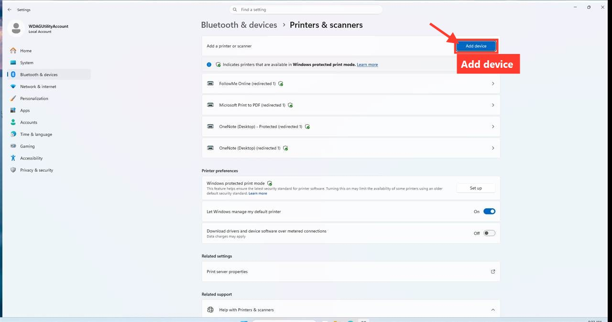

<p align="center">
  
</p>

# Sandbox Pilot

**An MCP server that lets an AI agent drive a disposable Windows Sandbox — see the screen, read the UI tree, click/type/scroll, OCR, and even assemble step-by-step screenshot guides — all inside a throwaway VM that resets when it closes.**

Sandbox Pilot exposes [Windows Sandbox](https://learn.microsoft.com/en-us/windows/security/application-security/application-isolation/windows-sandbox/windows-sandbox-overview) to any [Model Context Protocol](https://modelcontextprotocol.io) client (Claude, Codex, etc.) as a clean set of tools. The AI gets a real, isolated Windows desktop it can operate like a human — without touching your host machine.

---

## Why

- **Safe by construction** — everything happens in Windows Sandbox. Close it and all changes vanish. Great for testing installers, reproducing bugs, trying risky steps, or writing how-to guides.
- **Accessibility-first sensing** — prefers the **UI Automation tree** (cheap, exact click coordinates) over screenshots, and falls back to vision/OCR only when an app exposes nothing.
- **Fast** — a persistent TCP socket between host and guest gives ~40–50 ms command round-trips; screenshots come back inline as downscaled JPEG.
- **Batteries included** — UIA actuation, mouse/keyboard primitives, OCR (bundled Tesseract fallback), image annotation, and an automatic Markdown **guide builder**.

## What it can do

| Area | Tools |
|---|---|
| **Sense** | `sandbox_screenshot` (full screen / region / foreground window, inline JPEG), `sandbox_ui_tree` (UIA tree with real-pixel click points), `sandbox_ocr` (Windows OCR + bundled Tesseract fallback), `sandbox_health` |
| **Act (UIA)** | `sandbox_invoke` — actuate a control by name/automationId via Invoke / Toggle / Select / Expand / SetValue (no coordinates, no focus fuss) |
| **Act (input)** | `sandbox_click`, `sandbox_double_click`, `sandbox_scroll`, `sandbox_drag`, `sandbox_type`, `sandbox_key`, `sandbox_open`, `sandbox_run_ps` (with timeout), `sandbox_center_window`, `sandbox_set_resolution` |
| **Synchronize** | `sandbox_wait_for` — block until a UI element appears/disappears (no guessed sleeps) |
| **Watch (real-time)** | `sandbox_watch_start` / `sandbox_watch_poll` / `sandbox_wait_for_event` / `sandbox_watch_stop` — a background event bus (auto-started at boot) notices windows opening/closing, foreground changes, processes starting/exiting, programs installing/removing, and files appearing/disappearing the moment they happen; block on an event (multi-type + regex) or drain them between actions — the event-driven replacement for blind sleeps |
| **Bridge files** | `sandbox_bridge_info`, `sandbox_stage_host_path` - discover the active host/guest bridge and copy host files or folders into `C:\SandboxBridge\processed` |
| **WinGet** | `sandbox_winget_bootstrap`, `sandbox_winget` - install WinGet into a vanilla Sandbox, then search/show/install/upgrade/uninstall/list packages. Pins the `winget` source (avoids the GUI-prone `msstore`), runs silent/non-interactive, streams live install progress, and returns a decoded `outcome` + exit code instead of raw noise |
| **Install + profile** | `sandbox_install_and_profile` - the whole app-packaging loop in one call: snapshot → install → snapshot → diff the footprint → synthesize Intune-style detection rule(s) (MSI product code → uninstall-key DisplayVersion → presence → new exe) → verify the recommended rule live in the Sandbox |
| **Installers** | `sandbox_find_install_candidates`, `sandbox_msi_inspect`, `sandbox_analyze_installers`, `sandbox_test_install_command`, `sandbox_verify_detection_rule` - inspect installer payloads, infer silent commands, verify installs, and prove detection rules in the disposable VM |
| **Test** | `sandbox_assert` (file/registry/process/service/window/installedProgram/msiProductCode/script pass-fail checks), `sandbox_run_test_plan` - run a declarative step list and emit JUnit XML + a screenshot-embedded Markdown report |
| **Snapshot / diff** | `sandbox_snapshot`, `sandbox_diff_snapshots` - baseline files/registry/programs/services, then diff before vs after to see exactly what an installer changed (footprint docs + uninstall-residue checks) |
| **Diagnostics** | `sandbox_event_logs` - collect Application/System event-log entries (Critical/Error/Warning + MsiInstaller) for a time window; `sandbox_test_install_command` also captures them around the install window |
| **Intune packaging** | `sandbox_test_intune_deployment`, `sandbox_build_packaging_dossier`, `sandbox_intune_prereqs`, `sandbox_intune_package_win32`, `sandbox_intune_package_from_host` - run an IME-style install/uninstall simulation, verify detection, build a packaging dossier, auto-install Microsoft's Win32 Content Prep Tool if needed, and save `.intunewin` packages to shared artifacts |
| **Long jobs** | `sandbox_start_job`, `sandbox_job_status`, `sandbox_job_cancel` - run long PowerShell operations without blocking the MCP call, with persisted stdout/stderr artifacts |
| **Document** | `sandbox_annotate` (boxes/arrows/labels/spotlight/**redact**), `sandbox_record_start` + `sandbox_record_stop` (auto-capture a step per action), `sandbox_guide_step` + `sandbox_guide_build` (Markdown/HTML/PDF) + `sandbox_guide_reset` |
| **Lifecycle** | `sandbox_prepare` (one call to a control-ready Sandbox; `fresh=true` to force a clean boot), `sandbox_stop` (reset — destroy the VM), `sandbox_status`, `sandbox_cleanup` (prune old run artifacts) |

Sandbox Pilot also exposes MCP prompts/resources for common workflows:
`intune_package_app_from_folder`, `silent_install_test_workflow`, `user_guide_creation_workflow`,
`sandbox-pilot://workflows/intune-packaging`, `sandbox-pilot://workflows/user-guide`, and
`sandbox-pilot://schemas/detection-rule`.

> **Agent compatibility.** The guest agent reports a version and wire-protocol number; `sandbox_health` compares them against the server's and returns a `compatibility` block. If it carries a `warning`, the agent in the Sandbox is stale — redeploy it with `host\SandboxBridge.ps1 reload-agent`. Run artifacts (job logs, test-plan runs, snapshots, screenshots) accumulate in the shared bridge; `sandbox_cleanup` prunes them by age/count (recorded guides are left alone unless you opt in).

> **Reset semantics.** `wsb` runs the Sandbox VM detached, so closing the interactive window only closes the *viewer* — the VM (and all its guest state) keeps running. `sandbox_prepare` reuses a running Sandbox by default (no ~60s boot), which means state persists between sessions. Call `sandbox_stop` (or `sandbox_prepare` with `fresh=true`) to actually destroy the VM and start clean. The guest desktop is also pinned to a clean **1920×1080** on prepare, since the RDP session otherwise boots at a tiny or microscopic resolution.

> Example output: the guide builder turns a sequence of captioned, annotated screenshots into a Markdown document.
> - [`examples/windows-language-guide`](examples/windows-language-guide) — plain captured steps (change the Windows display language).
> - [`examples/annotated-printer-guide`](examples/annotated-printer-guide) — the **annotation** feature in action: boxes, arrows and labels drawn straight onto the screenshots, placed from the same pixel rectangles the AI uses to click.



## How it works

```mermaid
flowchart LR
    A[MCP client<br/>Claude / Codex] -- stdio --> B[Sandbox Pilot<br/>MCP server &#40;Node/TS&#41;]
    B -- "TCP socket &#40;NDJSON + auth token&#41;" --> C[Guest agent<br/>PowerShell in the Sandbox]
    B -. "wsb start / exec &#40;lifecycle&#41;" .-> D[Windows Sandbox]
    C -- "UI Automation / System.Drawing / Win32 input" --> D
```



- **Host** ([`host/SandboxBridge.ps1`](host/SandboxBridge.ps1)) manages the Sandbox lifecycle via the `wsb` CLI and a small mapped folder.
- **Guest agent** ([`guest/SandboxAgent.ps1`](guest/SandboxAgent.ps1)) runs inside the Sandbox, listens on a TCP socket, and executes commands using UI Automation, `System.Drawing` (capture), and Win32 input.
- **MCP server** ([`src/`](src/), built to `dist/`) translates MCP tool calls into agent commands. The guest connects *out* to the host (no host firewall changes needed) and authenticates with a per-session token.

See [`docs/SERVER.md`](docs/SERVER.md) for the deep technical reference (transports, latency numbers, internals).

## Requirements

- **Windows 11 Pro / Enterprise / Education** with the **Windows Sandbox** optional feature enabled, and virtualization available.
- A recent Windows 11 build that ships the **`wsb` CLI** (`wsb start/exec/share/connect`).
- **Node.js 18+** (developed on 24).
- Windows PowerShell 5.1 (built in) — used by the host/guest scripts.

Enable Windows Sandbox (admin PowerShell, one time):

```powershell
Enable-WindowsOptionalFeature -FeatureName "Containers-DisposableClientVM" -All -Online
```

## Install

### A) Add it to your MCP client with `npx` (no clone)

`npx` fetches, builds, and runs Sandbox Pilot straight from GitHub — so adding it is one line.

**Claude Code:**

```powershell
claude mcp add sandbox-pilot --env SANDBOX_TRANSPORT=socket -- npx -y github:Roofbacon/Sandbox-Pilot
```

**Claude Desktop / other config-based clients** — add to the `mcpServers` config:

```json
{
  "mcpServers": {
    "sandbox-pilot": {
      "command": "npx",
      "args": ["-y", "github:Roofbacon/Sandbox-Pilot"],
      "env": { "SANDBOX_TRANSPORT": "socket" }
    }
  }
}
```

**Codex** (`~/.codex/config.toml`):

```toml
[mcp_servers.sandbox-pilot]
command = "npx"
args = ["-y", "github:Roofbacon/Sandbox-Pilot"]
env = { SANDBOX_TRANSPORT = "socket" }
```

Requires **Node 18+ and Git** on PATH. The first launch clones + builds (~30–60 s, then cached). Runtime files and the optional Tesseract bundle live under npm's npx cache; pin them elsewhere with `SANDBOX_BRIDGE_ROOT` if you prefer.

### B) Clone and run locally (best for development)

```powershell
git clone https://github.com/Roofbacon/Sandbox-Pilot.git
cd Sandbox-Pilot
.\setup.ps1     # checks prereqs, installs + builds (npm install auto-builds), prints your client config
```

`setup.ps1` prints a `node <abs path>\dist\index.js` config you can paste instead of the npx one.

## Quick start

1. **Add the server** to your client (see **Install** above) and restart the client.

2. **Bring up a control-ready Sandbox** — either ask the agent to call the `sandbox_prepare` tool (first cold boot takes ~1–2 min), or, with a local clone, run it yourself:

   ```powershell
   .\host\SandboxBridge.ps1 prepare-socket
   ```

3. **Use it.** A typical agent loop:
   - `sandbox_ui_tree` to find a control → `sandbox_invoke` to click it (or `sandbox_click` with the returned coordinates),
   - `sandbox_wait_for` to sync on the next screen,
   - `sandbox_screenshot` for a visual check, `sandbox_ocr` when the UI tree is empty,
   - `sandbox_guide_step` / `sandbox_guide_build` to capture a how-to as you go.

## Sensing guidance (what the agent should prefer)

1. **`sandbox_ui_tree` first** — it returns control type, name, automationId, bounding rect, and a ready-to-use real-pixel `click` point. Cheapest and most reliable.
2. **`sandbox_invoke`** to actuate by element (Invoke/Toggle/Select/SetValue) — no coordinate math, robust to window movement.
3. **`sandbox_screenshot`** for genuine visual judgment (rendering, images). Use `window`/`region` to keep it sharp and small.
4. **`sandbox_ocr`** when an app exposes no UI tree (Chromium/CEF dialogs, custom-drawn UIs, games) — returns words with real-pixel click points.

## Installer analysis workflow

Windows Sandbox does not include WinGet or the Microsoft Store. Use `sandbox_winget` with a known package id such as `Microsoft.VisualStudioCode` to bootstrap WinGet if needed and install directly; or call `sandbox_winget_bootstrap` first when you want to separate the bootstrap from the install. The bootstrap uses Microsoft's current `Microsoft.WinGet.Client` / `Repair-WinGetPackageManager -Latest` flow and retries until `winget` actually responds.

`sandbox_winget` is tuned for unattended Sandbox use:

- **Pins the community `winget` source by default** so it never reaches into `msstore`, which needs a signed-in Microsoft account and pops Store/login GUIs that hang an automated run. Set `source: "msstore"` (or `preferWingetSource: false`) only if you really need it.
- **Silent, non-interactive install/upgrade** (`--silent --disable-interactivity` + agreement flags) so installers do not block on a GUI.
- **Action-aware timeouts** (10 min for install/upgrade/uninstall, 2 min for search/show/list) and a fixed pipe-buffer deadlock in the capture path that previously surfaced as bogus timeouts on chatty installers.
- **Interpreted results**: every call returns an `outcome` (`success` / `noop` / `notFound` / `needsInput` / `needsAttention` / `failed` / `timeout`), the decoded WinGet exit code (e.g. `NO_APPLICABLE_INSTALLER`, `PACKAGE_ALREADY_INSTALLED`), a human-readable `message`, and an `output` field with the progress-bar noise stripped — alongside the raw stdout/stderr/exit code. "Already installed" and "nothing to upgrade" report `succeeded: true` (outcome `noop`) instead of looking like a failure.

### One-shot install → footprint → detection rule

`sandbox_install_and_profile` runs the whole packaging loop in a single call: it snapshots the system, installs the package with WinGet (streaming live progress, with a numeric download percentage), snapshots again, diffs the two to capture the **footprint** (new programs / registry values / services, and optionally files), **synthesizes** candidate Intune-style detection rules from the diff — MSI product code → uninstall-key `DisplayVersion` → key presence → a new executable, best first, ranking the actual app above any runtimes it dragged in (e.g. VC++ redist) — and then **verifies** the recommended rule inside the Sandbox. The result bundles the install outcome, the footprint diff, the ranked rules, the verification verdict, and the clean `baselineSnapshotId`, turning "install X" into "here is how Intune will detect X, proven." (Programs snapshots carry their concrete uninstall `keyPath` so the registry rule targets the exact key.)

`sandbox_uninstall_and_profile` is the cleanup half: it uninstalls (streaming), diffs to show what was **removed**, and — given the `baselineSnapshotId` from the install profile — reports **residue** (files/registry/programs left behind vs the clean baseline), optionally verifying the detection rule now reports *absent*. Together the two prove a clean install **and** a clean uninstall.

Long PowerShell commands can stream too: `sandbox_run_ps_stream` runs a command as a background job and streams its stdout via progress notifications (honoring cancellation and an overall timeout), while `sandbox_run_ps` stays the quick synchronous path.

For software dropped into the Sandbox, start with `sandbox_find_install_candidates` against Downloads, then use `sandbox_analyze_installers` on the highest-ranked folder or payload directory. MSI packages can be inspected directly with `sandbox_msi_inspect`, which returns product metadata, public properties, notable reboot/config flags, and a ready-to-test `msiexec /i ... /qn /norestart /L*v ...` command.

For software that already exists on the host, call `sandbox_stage_host_path` first. It copies a host path such as `W:\Software\App` or `C:\Users\me\Downloads\App` into the shared bridge and returns the guest path to use with installer tools. `sandbox_bridge_info` reports the active bridge root when an agent needs to explain where files are moving.

When you have a candidate silent command, run it through `sandbox_test_install_command`. It executes inside the disposable VM with a timeout and reports the exit code, visible windows, newly registered installed programs, pending-reboot signals, and installer log tails, so an agent can distinguish "switches look plausible" from "this actually installed silently."

Use `sandbox_verify_detection_rule` to prove the detection rule separately from the installer command. It supports MSI product code, registry, file/version, and PowerShell script rules, and can check either expected-present or expected-absent state.

When an install fails, `sandbox_test_install_command` captures Windows Event Log entries (Application/System) around the install window by default — Critical/Error/Warning levels plus `MsiInstaller` result events (1033/1034/11707/11708) — so the failure cause is often visible without re-running. `sandbox_event_logs` collects the same data for an arbitrary window (`lastMinutes` or explicit `startTime`/`endTime`) after the fact, and a test-plan `run` step can set `collectEventLogs` to fold the events into `summary.md` on failure.

For operations that may outlive a normal MCP tool call, use `sandbox_start_job` and poll with `sandbox_job_status`. Jobs persist stdout/stderr under `C:\SandboxBridge\artifacts\jobs`, and `sandbox_job_cancel` kills the running process tree if needed.

## Testing workflow

`sandbox_assert` evaluates one or more pass/fail checks about the Sandbox state and returns a normalized roll-up. Each assertion has a `type` (`file`, `registry`, `msiProductCode`, `script`, `process`, `service`, `window`, `installedProgram`) and an `expectedPresent` flag, so you can prove both presence (after install) and absence (after uninstall) with the same primitive.

`sandbox_run_test_plan` runs an ordered list of steps and produces a report. Each step may launch something (`open`), run a command whose exit code is checked (`run` / `expectExitCode`), assert state (`assert`), and capture a screenshot (`capture`). A failing step skips the rest by default (`continueOnFailure` to override). The runner writes `junit.xml` (drops straight into CI), `results.json`, and a screenshot-embedded `summary.md` under `bridge\artifacts\testplans\<runId>`, and returns the roll-up plus host paths. The same plan doubles as a regression test and as a generated walkthrough.

```jsonc
{
  "name": "Acme silent install",
  "steps": [
    { "name": "Silent install", "run": "msiexec /i C:\\SandboxBridge\\processed\\Acme\\acme.msi /qn /norestart",
      "assert": [{ "type": "installedProgram", "name": "Acme", "minVersion": "1.2.0", "label": "Acme installed" }],
      "capture": { "caption": "Installed and detected" } },
    { "name": "Service is running", "assert": [{ "type": "service", "name": "AcmeSvc", "status": "Running" }] },
    { "name": "Silent uninstall", "run": "msiexec /x {GUID} /qn", "expectExitCode": 0,
      "assert": [{ "type": "installedProgram", "name": "Acme", "expectedPresent": false, "label": "no residue" }] }
  ]
}
```

## Footprint & residue workflow

`sandbox_snapshot` captures a baseline of the Sandbox state — files under common install roots (Program Files, ProgramData, AppData, Start Menu), registry values under the Uninstall and Run keys, installed programs, and services. Capture one before an install and one after, then `sandbox_diff_snapshots` reports exactly what changed (added / removed / modified per category) and writes a human-readable `diff.md` under `bridge\artifacts\snapshots\diffs\<diffId>`. Because a fresh Sandbox is nearly empty, an app's footprint stands out clearly.

The same diff doubles as an **uninstall-residue check**: snapshot a clean baseline, install, uninstall, snapshot again, and diff the post-uninstall state against the clean baseline — anything left behind shows up as added files/keys/services. The footprint diff is also useful documentation in its own right ("installing X creates these files and this service"). Both file roots and registry roots are overridable for targeted snapshots.

## Intune packaging workflow

For a normal packaging proof, start with `sandbox_test_intune_deployment`. It stages a host source folder into an isolated IME-like content cache, runs the install command from that working directory, supports `system` or user-context execution and x64/x86 PowerShell, collects event logs and blocking UI evidence, verifies the detection rule after install, runs uninstall, verifies the rule is absent, attaches footprint/residue diffs, and can write a Markdown/JSON dossier in one call.

Use `sandbox_build_packaging_dossier` when you already have deployment/package evidence and want a handoff document. The dossier records commands, detection rule, verdict, warnings, package hashes, source manifest, footprint, residue, and artifact paths under `bridge\artifacts\dossiers`.

For a normal host folder, prefer `sandbox_intune_package_from_host`. It stages the host source folder, tests the install command from that staged source directory by default, verifies the detection rule, tests the uninstall command when one is available, verifies the detection rule is absent afterward, then runs packaging inside the Sandbox only after the smoke test succeeds. It returns host paths for the generated `.intunewin` packages, avoiding any need to know where the bridge folder lives.

Use `sandbox_intune_package_win32` after you have a source folder, setup file, and install/uninstall commands. By default it runs install, detection, uninstall, and detection-absent checks first, and skips package creation if any concrete check fails. Pass `testInstall: false`, `verifyDetection: false`, or `testUninstall: false` only when intentionally bypassing that validation. If `IntuneWinAppUtil.exe` is missing, the tool can download the official Microsoft Win32 Content Prep Tool into `C:\SandboxBridge\tools`, keeping it outside the package source folder.

Generated `.intunewin` files are written to `C:\SandboxBridge\artifacts\intune` by default and returned with host paths under `bridge\artifacts\intune`, so the user can pick them up directly. The result also includes install-test, detection, uninstall-test, and detection-absent results, packaging stdout/stderr, the Intune install/uninstall command summary, an MSI product-code detection suggestion when applicable, and standard return-code recommendations.

## Noticing things in real time

The agent senses on demand (screenshot / UI tree), so on its own it only "sees" the screen when it looks. The **event bus** closes that gap: a background runspace (auto-started at boot, reconfigurable via `sandbox_watch_start`) diffs — every ~300 ms for windows/processes, and on a throttled cadence for the heavier scans — the top-level windows, foreground window, process names, **installed programs** (uninstall registry), and **files in the watched dirs** (Downloads/Desktop), recording each change as a timestamped, cursor-indexed event.

- `sandbox_wait_for_event` **blocks** until a new matching event occurs — match any of several `types` and/or a `regex`/`contains` over the value — the event-driven replacement for "sleep N seconds and hope." Event types: `windowOpened`/`windowClosed`, `foregroundChanged`, `processStarted`/`processExited`, `programInstalled`/`programRemoved`, `fileCreated`/`fileRemoved`/`fileRenamed` (real-time recursive), `serviceInstalled`/`serviceRemoved`/`serviceStateChanged`, `scheduledTaskAdded`/`scheduledTaskRemoved`, and `autorunAdded`/`autorunRemoved`/`autorunChanged` (Run-key persistence). e.g. wait for `types:['programInstalled'] regex:'Acrobat'` after an install, `types:['autorunAdded']` to catch an installer setting persistence, or `types:['windowOpened'] regex:'(?i)error|user account control'` to catch a blocking dialog.
  - **Race-free pattern:** to wait for the effect of an action you're about to take, read the cursor from `sandbox_watch_poll` first, trigger the action, then pass that cursor as `sinceId` (otherwise an event that fires before the wait arms is missed).
- `sandbox_watch_poll` cheaply drains everything new since the last poll (no screenshot).
- `sandbox_test_install_command` reports `windowsDuringRun` — so an unexpected modal dialog during a silent install is surfaced automatically, even if it opened and closed before the command returned.

`sandbox_winget` install/upgrade also **stream live progress** via MCP progress notifications while running as a background job, so a long install shows movement instead of a frozen call (and never blocks other Sandbox commands).

This doesn't let the model react while idle (MCP is turn-based — nothing interrupts it mid-thought), but it means the agent never misses a system event and can block until one happens — reacting the instant it does rather than padding a sleep.

## Guides & documentation

There are two ways to build a step-by-step guide:

- **Manual** — call `sandbox_guide_step` at each point you want captured, with your own caption and optional annotations.
- **Auto-record** — call `sandbox_record_start` with a guide name, then just drive the task. Every action (`sandbox_open` / `_click` / `_double_click` / `_invoke` / `_type` / `_key`) appends a captioned screenshot step, with the caption derived from the action (e.g. *Click "Add device"*, *Type "..."*) and, by default, an arrow/box marking the target. Call `sandbox_record_stop` when done. Drive it once, get the walkthrough for free.

`sandbox_guide_build` then assembles the steps into one or more documents — `markdown` (default), self-contained `html` (images embedded as base64, opens anywhere), and/or `pdf` — via the `formats` parameter.

**Redaction.** The annotation pipeline (`sandbox_annotate`, and the `shapes` of a guide step) supports a `redact` shape that blacks out or pixelates a region (`{ type: "redact", rect: [x,y,w,h], pixelate?: true }`) — use it to mask usernames, tokens, or machine names before a guide leaves your hands.

## Transports

Set `SANDBOX_TRANSPORT`:

- **`socket`** (recommended) — guest listens, host connects out; persistent NDJSON connection, ~40–50 ms round-trips, auth-token gated.
- **`file`** (default) — commands round-trip through the mapped folder. Simple, but the shared folder's host→guest propagation is cached (~20 s) — fine for batch use, too slow for interactive control.

## OCR

`sandbox_ocr` tries the built-in **Windows.Media.Ocr** engine first. A vanilla Windows Sandbox ships **no OCR language** (and can't reach the Store/Windows-Update feature endpoints), so the agent falls back to a **bundled Tesseract** under `bridge/tools/tesseract/`.

That bundle (~170 MB) is **not committed** (see `.gitignore`). Create it with **one command** (with a Sandbox running — do `prepare-socket` first):

```powershell
.\host\SandboxBridge.ps1 bundle-tesseract
```

This downloads Tesseract on the host, installs it inside the Sandbox (elevated, no UAC), copies the runtime into `bridge/tools/tesseract/` (persisted on the host), and trims it to the recognition essentials. It's **idempotent** (skips if already bundled). Tesseract is **optional** — without it, `sandbox_ocr` still works wherever a Windows OCR language is present, and otherwise returns a clear, actionable error.

## Development

```powershell
npm install     # installs + builds (prepare runs tsc)
npm test        # offline unit/integration tests (no Sandbox needed)
node smoke.mjs  # end-to-end smoke test against a running Sandbox (set SANDBOX_TRANSPORT=socket)
node mcp-e2e.mjs  # drives the MCP server against a running Sandbox, exercising health/assert/snapshot/diff/test-plan/record/guide/cleanup
node mcp-intune-e2e.mjs  # installer/Intune flow: find -> inspect -> install -> diff -> detect -> uninstall -> package (needs an MSI in C:\PkgSrc)
```

> `mcp-e2e.mjs` boots nothing itself — run `.\host\SandboxBridge.ps1 prepare-socket` (and `reload-agent` after editing the guest agent) first, then it connects an MCP client to `dist/index.js` and checks each feature against the live VM. `mcp-intune-e2e.mjs` additionally expects a real `.msi` staged in `C:\PkgSrc` inside the Sandbox.

After editing the guest agent, redeploy to a running Sandbox in one command:

```powershell
.\host\SandboxBridge.ps1 reload-agent
```

> Tip: avoid adding members to the PowerShell `SandboxInput` C# class — PowerShell's Add-Type assembly cache can load a stale type across reloads. Call existing P/Invokes (`mouse_event`, etc.) instead.

## Security & isolation

- Everything runs in **Windows Sandbox**; nothing persists after it closes.
- The socket is **auth-token gated** — the guest publishes a random per-session token the host must present as its first line; other connectors are rejected.
- The host↔guest **mapped folder is writable**, which weakens isolation. Keep it narrow and never run untrusted samples with broad host-folder mappings.
- The host only makes **outbound** connections; no inbound firewall rule is added on your machine.

## Known limitations

- **No Microsoft Store / live Windows-Update FODs** inside the Sandbox — so native display-language packs and Windows OCR languages can't be installed there. (OCR uses bundled Tesseract instead; see above.)
- The Sandbox's **interactive session can drop to a headless 200×200** between long idle gaps; `sandbox_health` reports it (`headless: true`) and `prepare-socket` / `reload-agent` restore it.
- Feature-on-Demand packs (if you want native OCR/languages) must be added **offline** from a build-matched FOD ISO.

## Repository layout

```
Sandbox-Pilot/
├─ src/               # the MCP server (TypeScript) — builds to dist/
├─ test/              # offline unit/integration tests
├─ host/              # SandboxBridge.ps1 (lifecycle + CLI), AnnotateScreenshot.ps1
├─ guest/             # SandboxAgent.ps1 — the in-Sandbox agent (source of truth)
├─ bridge/            # mapped host<->guest folder: source helpers (+ runtime files, gitignored)
├─ examples/          # generated guides (display-language change; annotated printer guide)
├─ docs/SERVER.md     # detailed server/transport reference
├─ package.json       # bin: sandbox-pilot -> dist/index.js
└─ setup.ps1          # one-command local setup
```

## License

[MIT](LICENSE) © 2026 Roofbacon.
