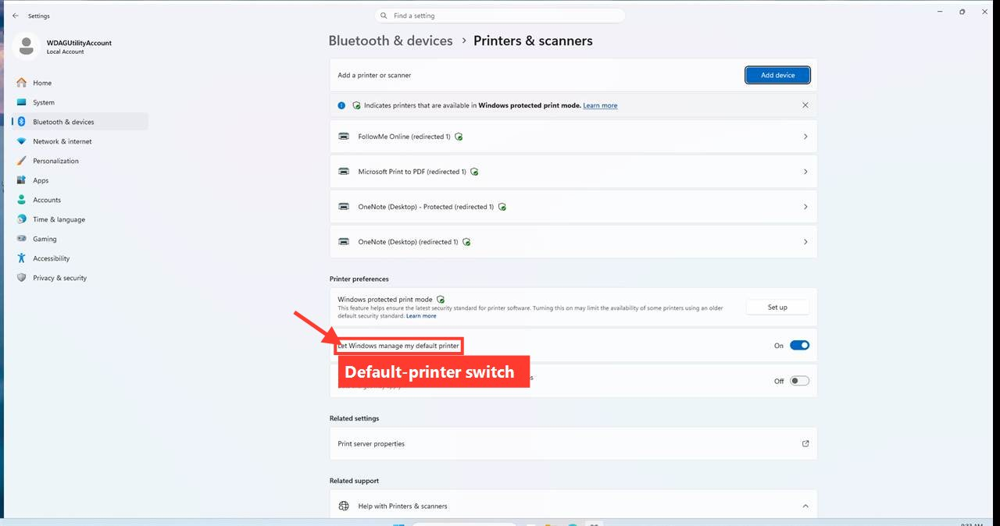
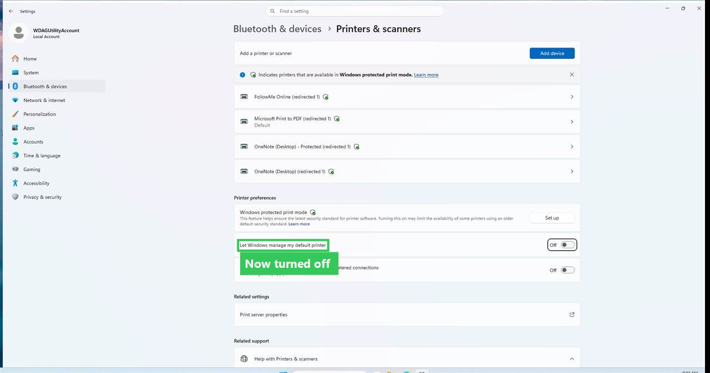

# Choose your own default printer in Windows 11

> **What this example shows.** Every screenshot below was captured *and annotated*
> by Sandbox Pilot driving a live Windows Sandbox — no manual editing. The red
> boxes, arrows and labels (and the green "done" callout in the last step) come
> from the `sandbox_annotate` tool, which draws onto a screenshot in real screen
> coordinates. Because the AI already knows each control's exact pixel rectangle
> from `sandbox_ui_tree` / `sandbox_wait_for`, it can point the reader straight at
> the thing to click. See [How this was generated](#how-this-was-generated) below.

## Step 1 — Open Printers & scanners

Open **Settings → Bluetooth & devices → Printers & scanners**. To add a printer
you would click **Add device** (top right).


## Step 2 — Find the default-printer switch

Scroll to **Printer preferences**. The switch **"Let Windows manage my default
printer"** decides whether Windows picks your default printer for you (it chooses
the last printer you used). To set your own default, this needs to be **off**.



## Step 3 — Turn it off

Turn the switch **off**. Windows will now leave your default printer alone, and
you can right-click any printer in the list and choose **Set as default**.



---

## How this was generated

A short MCP client script drove the whole thing. The interesting part is that the
annotations are placed from the **same rectangles the AI uses to click** — so the
arrow lands exactly on the control, every time:

```js
// 1. Locate the control — this returns its real-pixel rectangle [x, y, w, h]
const add = await call("sandbox_wait_for", {
  name: "Add a printer or scanner", controlType: "Button", timeoutMs: 10000,
});

// 2. Record a captioned, annotated step. `window: true` shoots just the
//    foreground window; the box/arrow/label are drawn in screen coordinates.
const [x, y, w, h] = add.rect;
await call("sandbox_guide_step", {
  guide: "manage-default-printer",
  caption: "To add a printer you would click **Add device** (top right).",
  window: true,
  shapes: [
    { type: "box",   rect: [x - 6, y - 6, w + 12, h + 12], color: "#FF3B30", thickness: 4 },
    { type: "arrow", from: [x - 90, y - 60], to: [x + 8, y + 8], color: "#FF3B30", thickness: 5 },
    { type: "label", at: [x, y + h + 10], text: "Add device", bg: "#FF3B30", size: 16 },
  ],
});

// 3. Actuate the toggle by name (no coordinates needed), re-locate it,
//    and record the "done" step with a green callout.
await call("sandbox_invoke", { name: "Let Windows manage my default printer", action: "toggle" });

// 4. Assemble all recorded steps into this Markdown document.
await call("sandbox_guide_build", { guide: "manage-default-printer", title: "Choose your own default printer in Windows 11" });
```

`sandbox_annotate` also works in **image mode** (coordinates relative to a screenshot
you already captured), which is the fallback for apps that expose no UI tree — there
the AI reads the layout from a screenshot (optionally via `sandbox_ocr`) and annotates
those pixels directly.
