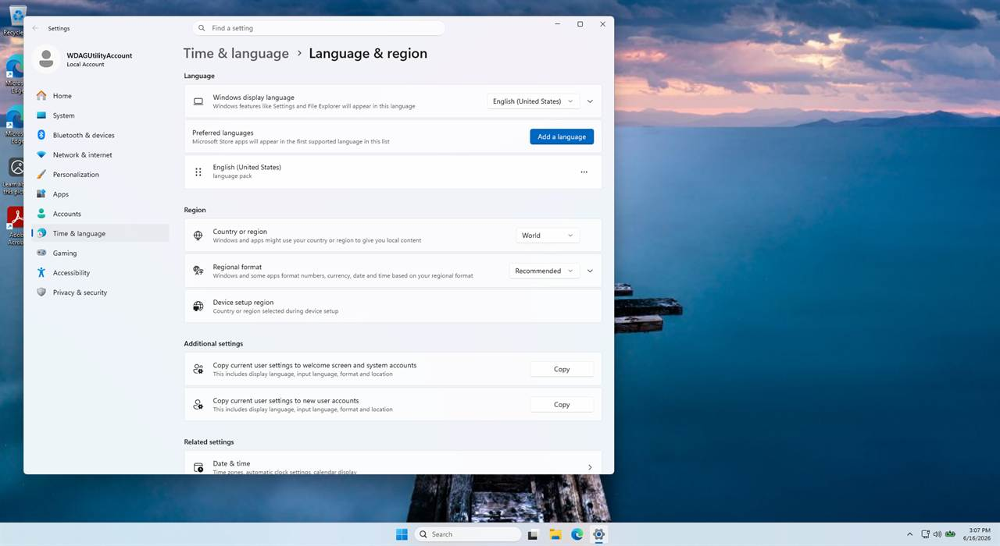
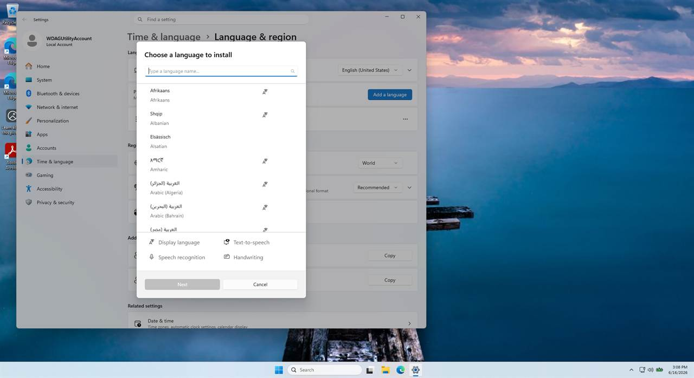
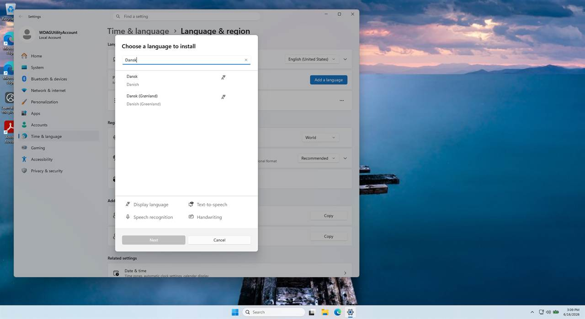
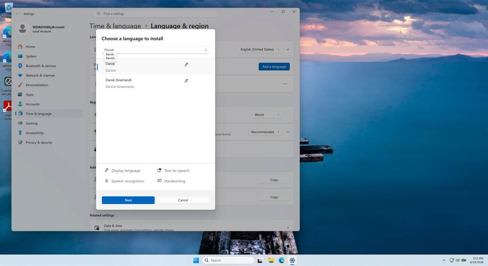
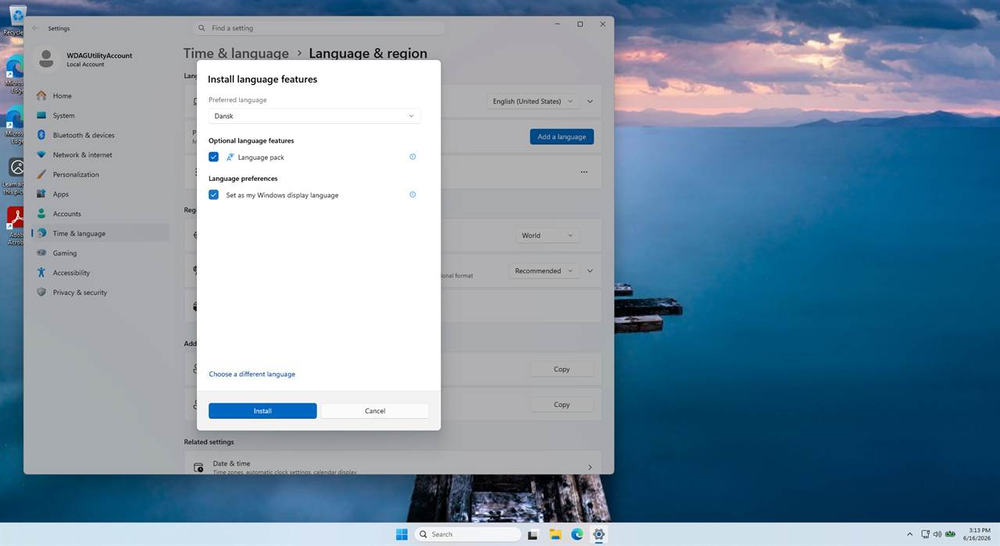

# Change the Windows display language from English to Danish

This guide walks through switching the **Windows 11 display language** from
English to Danish (Dansk). Once applied, Windows itself — and apps that follow
the system language, such as **Adobe Acrobat Reader** — will appear in Danish.

> **Why this instead of changing the language inside Adobe Reader?**
> Acrobat Reader does not ship its own Danish UI toggle. Its language dropdown
> (Menu → Preferences → Language → *Application Language*) only offers
> **English**, **Choose at application startup**, and **Same as the operating
> system**. To get Danish, you change the **Windows** display language and leave
> Acrobat on "Same as the operating system."

**Time required:** ~5 minutes plus a sign-out.
**You need:** An internet connection and permission to change settings on the PC.

---

## Step 1 — Open Language & region settings

Press **Win + I** to open **Settings**, then go to
**Time & language → Language & region**.

(Shortcut: press **Win + R**, type `ms-settings:regionlanguage`, and press Enter.)

At the top you will see **Windows display language**, currently set to
**English (United States)**.

---

## Step 2 — Add a language

Next to **Preferred languages**, click **Add a language**.

---

## Step 3 — Search for Danish

In the **Choose a language to install** window, type `Dansk` (or `Danish`) into
the search box. The list filters to **Dansk – Danish**.

---

## Step 4 — Select Dansk and continue

Click **Dansk** to select it, then click **Next**.

> Be sure to pick plain **Dansk (Danish)**, not **Dansk (Grønland) /
> Danish (Greenland)**.

---

## Step 5 — Set it as your Windows display language

On the **Install language features** screen:

1. Leave **Language pack** ticked (this is what translates the Windows interface).
2. Tick **Set as my Windows display language**.
3. Click **Install**.

---

## Step 6 — Windows applies Danish

Windows downloads the language pack and sets **Windows display language** to
**Dansk**. Date and number formats switch to the Danish/European style
immediately (for example, the date shows as `16-06-2026`).

---

## Step 7 — Sign out to finish

To apply the new language everywhere, **sign out and sign back in** (or
restart). When you click away, Windows prompts:
**"Will be displayed after the next sign-in"** — choose **Sign out**.

After signing back in, Windows menus, Settings, File Explorer, and apps set to
"Same as the operating system" (including **Adobe Acrobat Reader**) appear in
Danish.

---

## Verify Adobe Reader is in Danish

1. Open **Adobe Acrobat Reader**.
2. Open the **Menu (≡)** in the top-left → **Indstillinger** (Preferences) →
   **Sprog** (Language).
3. Confirm **Programsprog** (Application Language) is set to
   **Samme som operativsystemet** (Same as the operating system).

Acrobat now follows Windows and displays in Danish.

---

## Notes and troubleshooting

- **Changing back to English:** repeat the steps, choosing **English (United
  States)** in the *Windows display language* dropdown, then sign out.
- **The display-language pack must download from Microsoft.** On a normal
  Windows PC this happens automatically. If it fails with an error such as
  **0x80190194**, the pack could not be downloaded — see below.
- **Windows Sandbox limitation (how this guide was produced):** these steps were
  executed and captured in **Windows Sandbox**. Internet worked, and Danish was
  added and selected as the display language, but the language *pack* download
  failed with **0x80190194** because the Sandbox image has **no Microsoft Store**
  (display-language packs are delivered as Store "Local Experience Packs").
  This is a limitation of the disposable Sandbox, **not** of the procedure — on a
  standard Windows 11 installation the pack downloads and the interface fully
  switches to Danish.
